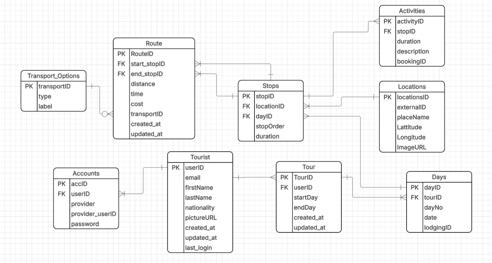

# TourSL Planning Service

A backend service for planning and managing multi-day tours across Sri Lanka.

## Project Overview

This project was developed as a personal software engineering project, to improve my knowledge and skills in backend development.

**TourSL** is a microservices-based tour planning platform for Sri Lanka. This repository contains the **Planning Service** — the core service responsible for managing tours, itineraries, stops, activities, and routes.

### System Services

| Service              | Responsibility                                      |
|----------------------|-----------------------------------------------------|
| **Planning Service** | Tour creation, itinerary management, stops, routes (this repo) |
| **Route Service**    | Route optimisation and pathfinding between locations |
| **Location Service** | Location search and discovery                       |
| **Budget Service**   | Budget tracking and expense management              |

The Planning Service acts as the central service that other services integrate with — routes reference stops managed here, locations are linked to stops, and budget data ties back to tours and activities.

The objective was to design a scalable backend using Spring Boot while following clean architecture principles and REST API best practices.

## Features

### Authentication
- JWT-based authentication with access and refresh tokens
- Google OAuth integration
- Password encryption with BCrypt
- Stateless session management

### Tour Management
- Create, update, and delete tours with date ranges
- Automatic day generation based on tour dates
- Date overlap validation (prevents overlapping tours per user)
- Start date / end date validation

### Day Management
- View days for a tour
- Update day details (lodging)
- Clear all stops from a day

### Stop Management
- Add stops to a day with location and duration
- Reorder stops within a day
- Move stops between days
- Unique stop order constraint per day

### Location Management
- Automatic location deduplication via external ID
- Coordinates (latitude/longitude) storage
- Image URL support

### Activity Management
- Add activities to stops with descriptions and durations
- Optional booking ID linkage
- Full CRUD operations

### Route Management
- Define routes between stops with distance, time, and cost
- Transport option support (bus, train, taxi, etc.)
- Automatic transport option deduplication
- Unique constraint on start-end stop pairs

## Architecture

### System Architecture

```
                        Frontend (React)
                              |
          ┌───────────────────┼───────────────────┐
          |                   |                   |
   Planning Service    Route Service      Location Service
     (this repo)       (optimisation)       (discovery)
          |                   |                   |
          └───────────────────┼───────────────────┘
                              |
                       Budget Service
                       (expense mgmt)
```

### Service Architecture (Planning Service)

```
   REST API (JSON)
         |
   Controller Layer
         |
    Service Layer
         |
   Repository Layer
         |
   PostgreSQL Database
```

- **Microservices Architecture** - independent services communicating via REST APIs
- **Layered Architecture** - clear separation between controller, service, and repository layers
- **REST API** - resource-oriented endpoints following REST conventions
- **MVC Pattern** - controllers handle HTTP, services handle business logic
- **Dependency Injection** - constructor-based injection via Spring IoC
- **Domain-Driven Packaging** - code organized by business domain (tour, stop, route, location, auth)

## Tech Stack

| Category       | Technology                  |
|----------------|-----------------------------|
| Language       | Java 17                     |
| Framework      | Spring Boot 4.1             |
| Security       | Spring Security, JWT (jjwt) |
| ORM            | Spring Data JPA, Hibernate  |
| Database       | PostgreSQL 16               |
| Migrations     | Flyway                      |
| Documentation  | Swagger / OpenAPI (springdoc)|
| Testing        | JUnit 5, Mockito, AssertJ   |
| Build Tool     | Maven                       |
| Containerization | Docker, Docker Compose    |
| Architecture   | Microservices               |
| Version Control| Git                         |

## Project Structure

```
src/main/java/com/tourplanner/planning
 ├── auth
 |    ├── controller        # Auth endpoints
 |    ├── dto               # Request/response DTOs
 |    ├── entity            # User, Account entities
 |    ├── exception         # Global exception handler
 |    ├── repository        # JPA repositories
 |    ├── security          # JWT filter, utility, UserDetailsService
 |    └── service           # Auth business logic
 ├── config                 # Security configuration
 ├── tour
 |    ├── controller        # Tour, Day endpoints
 |    ├── dto               # Tour/Day request/response DTOs
 |    ├── entity            # Tour, Day entities
 |    ├── repository        # JPA repositories
 |    └── service           # Tour/Day business logic
 ├── stop
 |    ├── controller        # Stop, Activity endpoints
 |    ├── dto               # Stop/Activity DTOs
 |    ├── entity            # Stop, Activity entities
 |    ├── repository        # JPA repositories
 |    └── service           # Stop/Activity business logic
 ├── location
 |    ├── dto               # Location DTOs
 |    ├── entity            # Location entity
 |    ├── repository        # JPA repository
 |    └── service           # Location business logic
 └── route
      ├── controller        # Route endpoints
      ├── dto               # Route/TransportOption DTOs
      ├── entity            # Route, TransportOption entities
      ├── repository        # JPA repositories
      └── service           # Route business logic
```

## Database Design

### ER Diagram

## API Documentation

### Authentication
| Method | Endpoint             | Description          |
|--------|----------------------|----------------------|
| POST   | `/api/auth/register` | Register a new user  |
| POST   | `/api/auth/login`    | Login with email     |
| POST   | `/api/auth/google`   | Google OAuth login   |
| POST   | `/api/auth/refresh`  | Refresh access token |

### Tours
| Method | Endpoint              | Description            |
|--------|-----------------------|------------------------|
| POST   | `/api/tours`          | Create a tour          |
| GET    | `/api/tours/{tourId}` | Get tour by ID         |
| GET    | `/api/tours/my-tours` | Get authenticated user's tours |
| PUT    | `/api/tours/{tourId}` | Update a tour          |
| DELETE | `/api/tours/{tourId}` | Delete a tour          |

### Days
| Method | Endpoint                 | Description             |
|--------|--------------------------|-------------------------|
| GET    | `/api/days/{dayId}`      | Get day by ID           |
| GET    | `/api/days/tour/{tourId}`| Get all days for a tour |
| PUT    | `/api/days/{dayId}`      | Update a day            |
| PUT    | `/api/days/{dayId}/clear`| Clear all stops from a day |

### Stops
| Method | Endpoint                          | Description                |
|--------|-----------------------------------|----------------------------|
| POST   | `/api/stops`                      | Add a stop                 |
| GET    | `/api/stops/{stopId}`             | Get stop by ID             |
| GET    | `/api/stops/day/{dayId}`          | Get all stops for a day    |
| PUT    | `/api/stops/{stopId}`             | Update a stop              |
| PUT    | `/api/stops/day/{dayId}/reorder`  | Reorder stops in a day     |
| PUT    | `/api/stops/{stopId}/move`        | Move stop to another day   |
| DELETE | `/api/stops/{stopId}`             | Delete a stop              |

### Activities
| Method | Endpoint                            | Description                   |
|--------|-------------------------------------|-------------------------------|
| POST   | `/api/activities`                   | Add an activity               |
| GET    | `/api/activities/{activityId}`      | Get activity by ID            |
| GET    | `/api/activities/stop/{stopId}`     | Get all activities for a stop |
| PUT    | `/api/activities/{activityId}`      | Update an activity            |
| DELETE | `/api/activities/{activityId}`      | Delete an activity            |

### Routes
| Method | Endpoint                    | Description                  |
|--------|-----------------------------|------------------------------|
| POST   | `/api/routes`               | Create a route               |
| GET    | `/api/routes/{routeId}`     | Get route by ID              |
| GET    | `/api/routes/day/{dayId}`   | Get all routes for a day     |
| PUT    | `/api/routes/{routeId}`     | Update a route               |
| DELETE | `/api/routes/{routeId}`     | Delete a route               |
| DELETE | `/api/routes/day/{dayId}`   | Delete all routes for a day  |

Interactive API docs available at `/swagger-ui.html` when the application is running.

## Security

- JWT authentication with access and refresh tokens
- BCrypt password hashing
- Stateless session management (no server-side sessions)
- Input validation using Jakarta Bean Validation
- Global exception handling with structured error responses
- SQL injection protection via JPA parameterized queries
- Google OAuth token verification
- Protected endpoints requiring valid Bearer token


## Future Improvements

- Email notifications for tour reminders
- Redis caching for frequently accessed tours
- CI/CD pipeline with GitHub Actions
- Cloud deployment (AWS/GCP)
- Rate limiting on auth endpoints
- WebSocket support for real-time collaboration
- Tour sharing between users
- Export itinerary to PDF

## Installation

### Prerequisites
- Java 17
- Maven
- Docker & Docker Compose

### Run with Docker

```bash
git clone <repository-url>
cd Planning-Service
docker compose up --build
```

The application will be available at `http://localhost:8001`.

### Run locally

```bash
# Start the database
docker compose up db -d

# Run the application
./mvnw spring-boot:run
```

## Environment Variables

Create a `.env` file in the project root:

```
DB_URL=jdbc:postgresql://localhost:5432/planning_db
DB_USER=<your-db-username>
DB_PASSWORD=<your-db-password>

JWT_SECRET=<your-jwt-secret-key>

GOOGLE_CLIENT_ID=<your-google-client-id>
```

## Testing

### Unit Tests
- Service layer tests with Mockito mocks
- Controller tests with MockMvc and WebMvcTest
- Covers happy paths, error cases, and edge cases

### Integration Tests
- Repository tests with `@DataJpaTest` against PostgreSQL
- Validates entity constraints, relationships, and custom queries

### API Testing
- End-to-end API testing with Apidog
- Endpoints imported via OpenAPI spec

### Run Tests

```bash
./mvnw test
```
