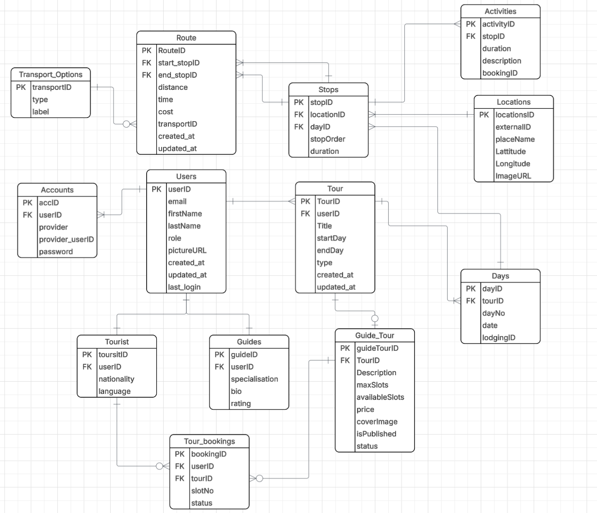

# TourSL Planning Service

A backend service for planning, managing, and booking multi-day tours across Sri Lanka.

## Project Overview

This project was developed as a personal software engineering project, to improve my knowledge and skills in backend development.

**TourSL** is a microservices-based tour planning platform for Sri Lanka. This repository contains the **Planning Service** — the core service responsible for authentication, tour planning, guide tour package management, and booking.

Two types of users:
- **Tourists** — plan their own trips or book guided tour packages
- **Guides** — create tour itineraries and publish them as bookable packages for tourists

### System Services

| Service                  | Responsibility                                                        |
|--------------------------|-----------------------------------------------------------------------|
| **Planning Service**     | Auth, tour planning, guide packages, bookings, stops, routes (this repo) |
| **Recommendation Engine** | Location search and discovery via Google Maps API                    |
| **Route Engine**         | Route optimisation and pathfinding between locations (to be implemented) |

The Planning Service acts as the central platform service. The Recommendation Engine provides location data for stops, and the Route Engine will handle optimal route calculations.

## Features

### Authentication & Authorization
- JWT-based authentication with access and refresh tokens
- Role stored as JWT claim — no per-request DB lookup
- Separate registration endpoints for tourists and guides
- Google OAuth integration (separate endpoints per role)
- Password encryption with BCrypt
- Stateless session management

### User Profiles
- **Tourist profile**: language, nationality
- **Guide profile**: bio, specializations, license number, rating

### Tour Management
- Create, update, and delete tours with date ranges
- Automatic day generation based on tour dates
- Tour type auto-set from user role (TOURIST or GUIDE)
- Date overlap validation (prevents overlapping tours per user)
- Automatic GuideTourPackage creation when a guide creates a tour

### Day Management
- View days for a tour
- Update day details (lodging)
- Clear all stops from a day

### Stop Management
- Add stops to a day with location and duration
- Reorder stops within a day
- Move stops between days
- Automatic route invalidation when stop order changes
- Unique stop order constraint per day

### Location Management
- Automatic location deduplication via external ID
- Coordinates (latitude/longitude) storage
- Image URL support

### Activity Management
- Add activities to stops with descriptions and durations
- Optional booking ID linkage
- Full CRUD operations

### Route Management
- Define routes between stops with distance, time, and cost
- Transport option support (bus, train, taxi, etc.)
- Automatic transport option deduplication
- Unique constraint on start-end stop pairs

### Guide Tour Package Management
- Auto-created in DRAFT status when a guide creates a tour
- Set package details: description, cover image, max slots, price per slot
- Publish/unpublish flow with status transitions
- Unpublish only allowed when no active bookings exist
- Package statuses: DRAFT → PUBLISHED → FILLED → PUBLISHED (when slots freed), CANCELLED

### Booking System
- Tourists book published guide packages
- Slot reservation at booking time — prevents race conditions via optimistic locking (`@Version`)
- 15-minute payment deadline with automatic expiry
- Auto-confirmation on payment (no manual guide approval needed)
- Cancellation by tourist or guide — slots always restored
- Duplicate booking prevention (one booking per tourist per package)
- Scheduled job expires unpaid bookings every 60 seconds
- Payment simulation endpoint (ready for Stripe integration)

### Ownership & Access Control
- Shared `TourAccessValidator` enforces ownership and modifiability across all services
- Only tour owners can modify their data (days, stops, routes, activities)
- Guide tours locked for editing when package is not in DRAFT status
- Read operations open to any authenticated user (tourists can view booked tour itineraries)

## Architecture

### System Architecture

```
                        Frontend (React)
                              |
          ┌───────────────────┼───────────────────┐
          |                   |                   |
   Planning Service   Recommendation Engine   Route Engine
     (this repo)         (location data)      (optimisation)
```

### Service Architecture (Planning Service)

```
   REST API (JSON)
         |
   Controller Layer
         |
    Service Layer (Interface + Impl)
         |
   Repository Layer (Spring Data JPA)
         |
   PostgreSQL Database
```

- **Microservices Architecture** — independent services communicating via REST APIs
- **Layered Architecture** — clear separation between controller, service, and repository layers
- **Interface + Implementation Pattern** — services defined as interfaces with separate implementations
- **REST API** — resource-oriented endpoints following REST conventions
- **Dependency Injection** — constructor-based injection via Lombok `@RequiredArgsConstructor`
- **Domain-Driven Packaging** — code organized by business domain (auth, tour, stop, route, location, booking)

## Tech Stack

| Category         | Technology                    |
|------------------|-------------------------------|
| Language         | Java 17                       |
| Framework        | Spring Boot 4.1               |
| Security         | Spring Security, JWT (jjwt)   |
| ORM              | Spring Data JPA, Hibernate    |
| Database         | PostgreSQL 16                 |
| Migrations       | Flyway (V1–V7)                |
| Scheduling       | Spring `@Scheduled`           |
| Documentation    | Swagger / OpenAPI (springdoc) |
| Testing          | JUnit 5, Mockito, AssertJ     |
| Build Tool       | Maven                         |
| Containerization | Docker, Docker Compose        |
| Version Control  | Git                           |

## Project Structure

```
src/main/java/com/tourplanner/planning
 ├── auth
 |    ├── controller        # Auth endpoints (register, login, OAuth, refresh)
 |    ├── dto               # RegisterRequest, LoginRequest, AuthResponse, etc.
 |    ├── entity            # User, Account, Tourist, Guide, Role, AuthProvider
 |    ├── exception         # Global exception handler
 |    ├── repository        # User, Account, Tourist, Guide repositories
 |    ├── security          # JwtUtil, JwtAuthenticationFilter, CustomUserDetailsService
 |    └── service           # AuthService interface + AuthServiceImpl
 ├── config                 # SecurityConfig, TourAccessValidator
 ├── tour
 |    ├── controller        # Tour, Day, GuideTourPackage endpoints
 |    ├── dto               # Tour/Day/GuideTourPackage request/response DTOs
 |    ├── entity            # Tour, Day, TourType, GuideTourPackage, PackageStatus
 |    ├── repository        # Tour, Day, GuideTourPackage repositories
 |    └── service           # Tour/Day/GuideTourPackage service interfaces + impls
 ├── stop
 |    ├── controller        # Stop, Activity endpoints
 |    ├── dto               # Stop/Activity DTOs
 |    ├── entity            # Stop, Activity entities
 |    ├── repository        # Stop, Activity repositories
 |    └── service           # Stop/Activity service interfaces + impls
 ├── location
 |    ├── dto               # Location DTOs
 |    ├── entity            # Location entity
 |    ├── repository        # Location repository
 |    └── service           # Location business logic
 ├── route
 |    ├── controller        # Route endpoints
 |    ├── dto               # Route/TransportOption DTOs
 |    ├── entity            # Route, TransportOption entities
 |    ├── repository        # Route, TransportOption repositories
 |    └── service           # Route service interface + impl
 └── booking
      ├── controller        # Booking endpoints
      ├── dto               # BookingRequest, BookingResponse
      ├── entity            # Booking, BookingStatus
      ├── repository        # Booking repository
      ├── scheduler         # BookingExpiryScheduler (expires unpaid bookings)
      └── service           # BookingService interface + BookingServiceImpl
```

## Database Design


## Database Migrations

| Migration | Description |
|-----------|-------------|
| V1 | Initial schema: users, account, tour, day, stop, location, activity, route, transport_option |
| V2 | Account table fixes |
| V3 | Flatten route options |
| V4 | Rename tourist→users, add role column, create tourist/guide profile tables |
| V5 | Add title/tour_type to tour, create guide_tour_package table with version column |
| V6 | Create booking table with indexes |
| V7 | Rename PENDING→PENDING_PAYMENT status, add payment_deadline column |

## API Documentation

### Authentication (Public)
| Method | Endpoint                      | Description                  |
|--------|-------------------------------|------------------------------|
| POST   | `/api/auth/tourist/register`  | Register as tourist          |
| POST   | `/api/auth/guide/register`    | Register as guide            |
| POST   | `/api/auth/tourist/google`    | Google OAuth as tourist       |
| POST   | `/api/auth/guide/google`      | Google OAuth as guide         |
| POST   | `/api/auth/login`             | Login (any user)             |
| POST   | `/api/auth/refresh`           | Refresh access token         |

### Tours (Authenticated)
| Method | Endpoint              | Description                          |
|--------|-----------------------|--------------------------------------|
| POST   | `/api/tours`          | Create a tour (auto-sets tour type)  |
| GET    | `/api/tours/{tourId}` | Get tour by ID                       |
| GET    | `/api/tours/my-tours` | Get authenticated user's tours       |
| PUT    | `/api/tours/{tourId}` | Update a tour                        |
| DELETE | `/api/tours/{tourId}` | Delete a tour                        |

### Days (Authenticated)
| Method | Endpoint                  | Description                |
|--------|---------------------------|----------------------------|
| GET    | `/api/days/{dayId}`       | Get day by ID              |
| GET    | `/api/days/tour/{tourId}` | Get all days for a tour    |
| PUT    | `/api/days/{dayId}`       | Update a day (lodging)     |
| PUT    | `/api/days/{dayId}/clear` | Clear all stops from a day |

### Stops (Authenticated)
| Method | Endpoint                         | Description              |
|--------|----------------------------------|--------------------------|
| POST   | `/api/stops`                     | Add a stop               |
| GET    | `/api/stops/{stopId}`            | Get stop by ID           |
| GET    | `/api/stops/day/{dayId}`         | Get all stops for a day  |
| PUT    | `/api/stops/{stopId}`            | Update a stop            |
| PUT    | `/api/stops/day/{dayId}/reorder` | Reorder stops in a day   |
| PUT    | `/api/stops/{stopId}/move`       | Move stop to another day |
| DELETE | `/api/stops/{stopId}`            | Delete a stop            |

### Activities (Authenticated)
| Method | Endpoint                        | Description                   |
|--------|---------------------------------|-------------------------------|
| POST   | `/api/activities`               | Add an activity               |
| GET    | `/api/activities/{activityId}`  | Get activity by ID            |
| GET    | `/api/activities/stop/{stopId}` | Get all activities for a stop |
| PUT    | `/api/activities/{activityId}`  | Update an activity            |
| DELETE | `/api/activities/{activityId}`  | Delete an activity            |

### Routes (Authenticated)
| Method | Endpoint                  | Description                 |
|--------|---------------------------|-----------------------------|
| POST   | `/api/routes`             | Create a route              |
| GET    | `/api/routes/{routeId}`   | Get route by ID             |
| GET    | `/api/routes/day/{dayId}` | Get all routes for a day    |
| PUT    | `/api/routes/{routeId}`   | Update a route              |
| DELETE | `/api/routes/{routeId}`   | Delete a route              |
| DELETE | `/api/routes/day/{dayId}` | Delete all routes for a day |

### Guide Tour Packages (Authenticated)
| Method | Endpoint                                       | Description                          |
|--------|------------------------------------------------|--------------------------------------|
| GET    | `/api/guide-packages/tour/{tourId}`            | Get package for a tour               |
| PUT    | `/api/guide-packages/tour/{tourId}`            | Update package details (DRAFT only)  |
| PATCH  | `/api/guide-packages/tour/{tourId}/publish`    | Publish a package                    |
| PATCH  | `/api/guide-packages/tour/{tourId}/unpublish`  | Revert to DRAFT (no active bookings) |
| PATCH  | `/api/guide-packages/tour/{tourId}/cancel`     | Cancel a package                     |
| GET    | `/api/guide-packages/my-packages`              | Guide's own packages                 |
| GET    | `/api/guide-packages/published`                | Browse all published packages        |

### Bookings (Authenticated)
| Method | Endpoint                              | Description                        |
|--------|---------------------------------------|------------------------------------|
| POST   | `/api/bookings`                       | Create a booking (reserves slots)  |
| PATCH  | `/api/bookings/{bookingId}/pay`       | Pay for a booking (auto-confirms)  |
| PATCH  | `/api/bookings/{bookingId}/cancel`    | Cancel a booking (restores slots)  |
| GET    | `/api/bookings/my-bookings`           | Tourist's own bookings             |
| GET    | `/api/bookings/package/{packageId}`   | Guide views bookings for a package |

Interactive API docs available at `/swagger-ui.html` when the application is running.

## Security

- JWT authentication with role claims (TOURIST/GUIDE)
- BCrypt password hashing
- Stateless session management (no server-side sessions)
- Ownership validation on all write operations
- Modifiability checks (guide tours locked when not in DRAFT)
- Optimistic locking for concurrent booking safety
- Input validation using Jakarta Bean Validation
- Global exception handling with structured error responses
- SQL injection protection via JPA parameterized queries
- Google OAuth token verification
- Protected endpoints requiring valid Bearer token

## Installation

### Prerequisites
- Java 17
- Maven
- Docker & Docker Compose

### Run with Docker

```bash
git clone <repository-url>
cd Planning-Service
docker compose up --build
```

The application will be available at `http://localhost:8001`.

### Run locally

```bash
# Start the database
docker compose up db -d

# Run the application
./mvnw spring-boot:run
```

## Environment Variables

Create a `.env` file in the project root:

```
DB_URL=jdbc:postgresql://localhost:5432/planning_db
DB_USER=<your-db-username>
DB_PASSWORD=<your-db-password>

JWT_SECRET=<your-jwt-secret-key>

GOOGLE_CLIENT_ID=<your-google-client-id>
```

## Testing

### Unit Tests
- Service layer tests with Mockito mocks
- Controller tests with MockMvc and WebMvcTest
- Covers happy paths, error cases, and edge cases

### Integration Tests
- Repository tests with `@DataJpaTest` against PostgreSQL
- Validates entity constraints, relationships, and custom queries

### API Testing
- End-to-end API testing with Apidog
- Endpoints imported via OpenAPI spec

### Run Tests

```bash
./mvnw test
```

## Future Improvements

- Stripe payment integration (replacing simulated `/pay` endpoint)
- Guide profile completion enforcement (filter blocking API access until profile is filled)
- Tour package tags/categories for search and filtering
- Email notifications for booking confirmations and tour reminders
- Redis caching for frequently accessed tours and published packages
- CI/CD pipeline with GitHub Actions
- Cloud deployment (AWS/GCP)
- Rate limiting on auth endpoints
- WebSocket support for real-time collaboration
- Tour sharing between users
- Export itinerary to PDF
